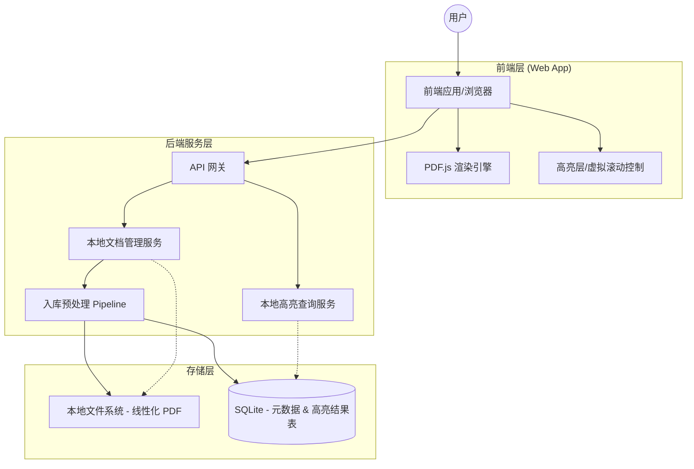
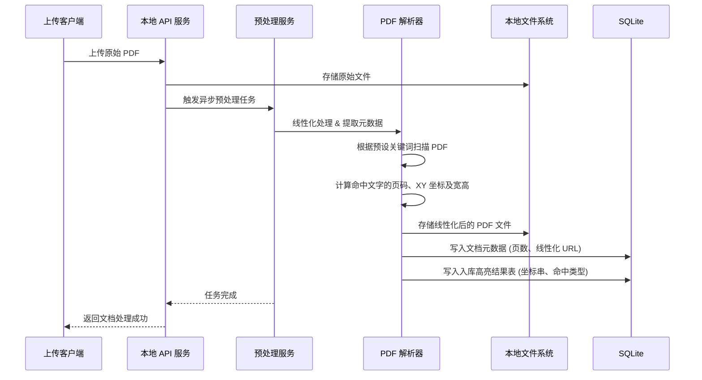
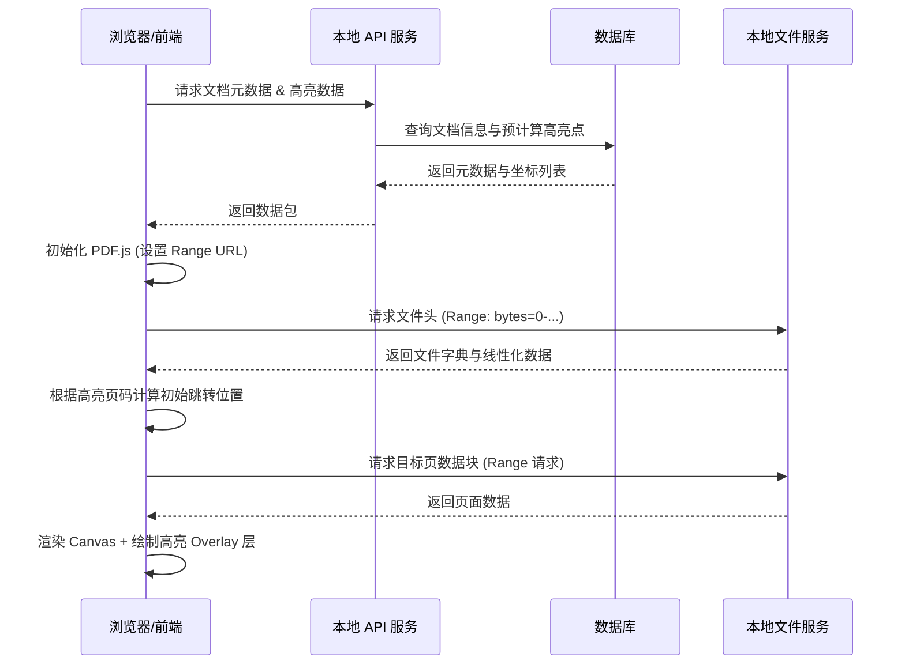
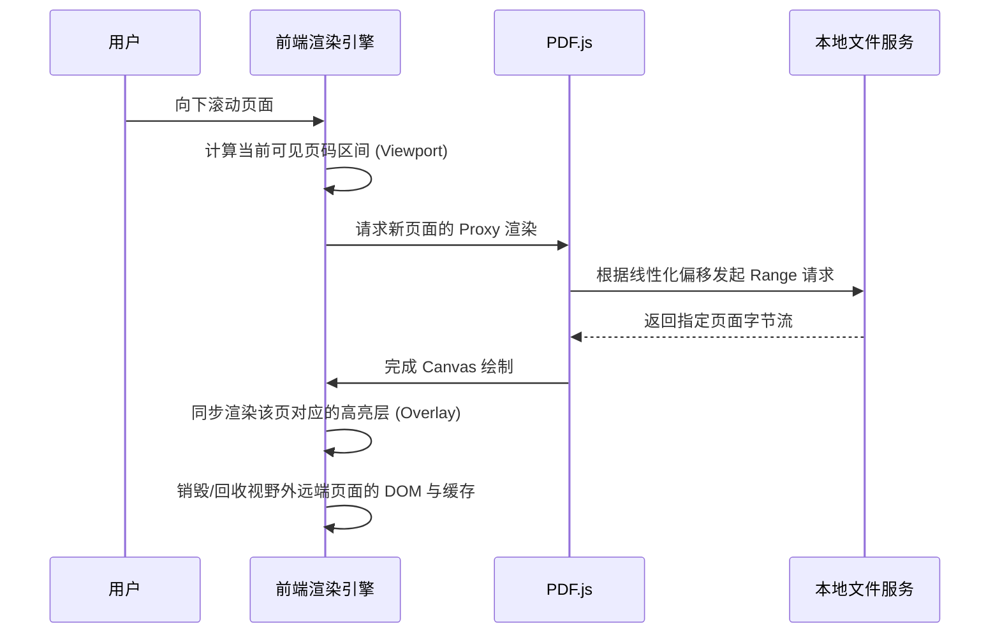
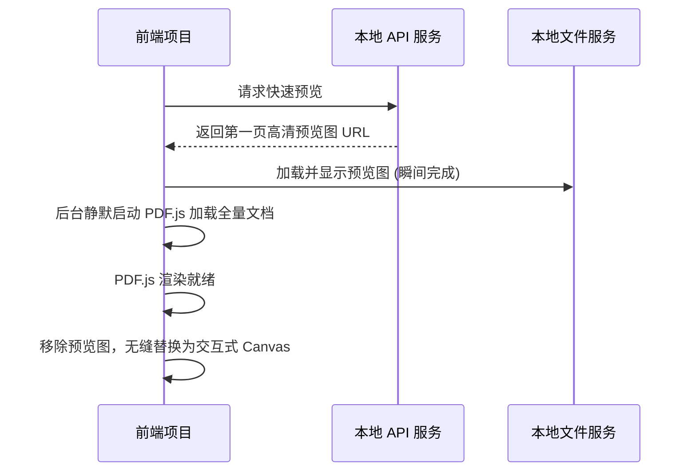

# 大页 PDF 预览与精准高亮系统架构文档（本地试验版）

- **版本**：v1.0.0
- **日期**：2026-04-10
- **部署方式**：单机本地前后端分离

## 1. 系统概述
本系统采用"入库预计算"策略，在文件上传阶段即完成坐标提取，配合 PDF.js 的 HTTP Range 增量请求能力，在本地前后端分离环境下实现首屏秒开与低内存占用。

## 2. 组件架构图

## 3. 数据流概览

## 4. 核心时序图

### 4.1 PDF 入库流程

### 4.2 PDF 打开与定位高亮流程

### 4.3 滚动加载流程

### 4.4 首屏单页预览流程 (可选)

## 5. 存储架构

1. **本地文件系统**：线性化 PDF + 预览图仓库。
2. **结构化数据库 (SQLite)**：
   - 文档表 (`docs`)：文件 ID、名称、总页数、MD5、本地路径。
   - 高亮结果表 (`highlight_results`)：`doc_id`、`page_number`、`rects` (JSON 文本)、`group_id`。

## 6. 部署拓扑建议

- **接入层**：本地静态文件服务或本地反向代理，直接暴露文件下载与 Range 能力。
- **计算层**：本地 API 服务 + 本地后台任务（PDF 解析，PDFBox/MuPDF）。
- **存储层**：本地文件系统 + SQLite。

## 7. 扩展性考虑

- **跨页高亮**：入库时拆分为两条记录，通过 `groupId` 关联，前端分别绘制。
- **坐标归一化**：入库存 PDF Point 坐标，前端根据 Canvas 实时 scale 缩放转换。
- **渐进式增强**：弱网下优先展示高亮文本内容，待字节流到达后再渲染图形化背景。
